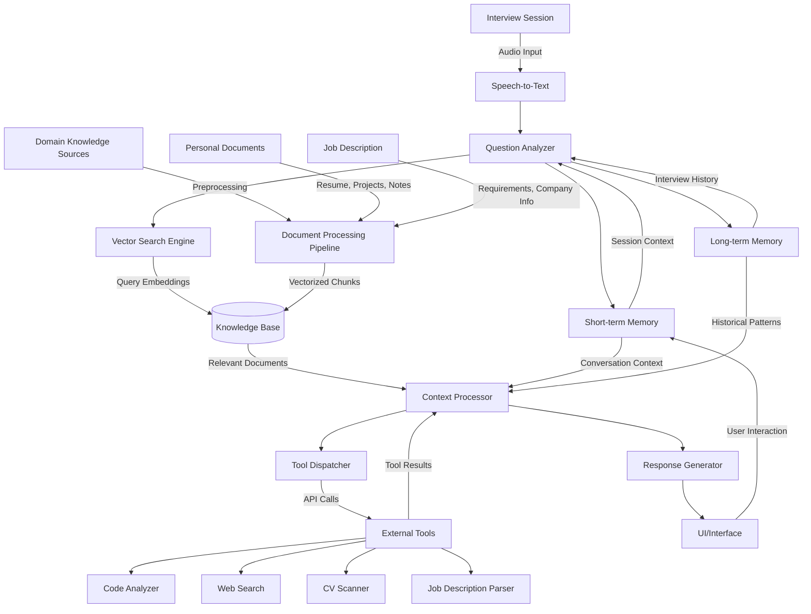

# PRD: RAG-Powered Real-Time AI Interview Assistant

## 1. Product Overview

The Real-Time AI Interview Assistant helps job candidates perform better in interviews by providing instant, personalized guidance during live interviews. Using Retrieval-Augmented Generation (RAG), the system listens to interviewer questions, retrieves relevant information from the candidate's knowledge base, and suggests optimal responses through a discreet interface.

## 2. Key Features

### 2.1 Personal Knowledge Base Integration

- Resume data ingestion and parsing
- Project portfolio integration
- Job description analysis
- Custom notes/talking points storage

### 2.2 Real-Time Question Processing

- Speech-to-text conversion of interviewer questions
- Question intent and domain classification
- Priority identification (technical knowledge, soft skills, experience)

### 2.3 Context-Aware Response Generation

- Structured answer frameworks (STAR method, technical explanations)
- Personalized examples from candidate's experience
- Bullet-point suggestions rather than full responses
- Code snippet suggestions for technical questions

### 2.5 Post-Interview Analysis

- Transcript generation with annotations
- Question categorization and pattern detection
- Response quality assessment
- Improvement recommendations

## 3. User Flows

### 3.1 Setup Flow

1. Upload resume, portfolio, and job description
2. Answer calibration questions about experience
3. Select interview type (technical, behavioral, etc.)
4. Configure interface preferences
5. Run practice session

### 3.2 Interview Session Flow

1. Start session before interview begins
2. Position device discreetly
3. System listens and processes interviewer questions
4. Real-time suggestions appear on screen
5. User references suggestions while formulating their own response
6. System continues monitoring for follow-up questions

### 3.3 Review Flow

1. Access interview transcript and analysis
2. Review question patterns and response effectiveness
3. Identify improvement areas
4. Save insights for future interviews

## 4. Technical Requirements

### 4.1 Enhanced RAG System Architecture

#### 4.1.1 Core Components

- **Document Processing Pipeline**

  - Parse resumes, portfolios, job descriptions
  - Chunk documents into searchable units
  - Generate embeddings with technical/professional focus
  - Index in vector database with metadata

- **Real-time Processing Stack**

  - Low-latency speech recognition (<500ms)
  - Question intent classifier
  - Hybrid retrieval system (vector + keyword search)
  - Context-aware prompt construction

- **Response Generation**
  - Adaptive response templates
  - Technical knowledge integration
  - Personalization layer

#### 4.1.2 Memory Systems

- **Short-term Memory**

  - Stores conversation context from current interview
  - Tracks recent questions and system-generated suggestions
  - Maintains awareness of interview flow and direction
  - Updates in real-time with each interaction

- **Long-term Memory**
  - Persists insights across multiple interviews
  - Stores patterns in interviewer questions and candidate responses
  - Records performance metrics and improvement areas
  - Builds a profile of candidate's strengths and weaknesses

#### 4.1.3 Tool Calling Framework

- **Tool Dispatcher**

  - Analyzes question requirements and selects appropriate tools
  - Manages asynchronous tool execution
  - Integrates tool outputs into response context

- **Specialized Tools**
  - **Code Analyzer**: Evaluates and suggests code snippets for technical questions
  - **Web Search**: Retrieves up-to-date information for technical or industry questions
  - **CV Scanner**: Extracts relevant experience points from resume based on question
  - **Job Description Parser**: Maps question to job requirements

### 4.2 System Architecture Diagram

## 5. Rollout Plan

- **Phase 1**: Beta with behavioral interviews only, basic memory system
- **Phase 2**: Full tool suite and advanced memory systems

## 6. Implementation Timeline

### Sprint 1-2: Foundation

- Set up RAG infrastructure
- Implement document processing pipeline
- Create basic speech-to-text integration
- Design short-term memory architecture

### Sprint 3-4: Core Features

- Build question analysis system
- Implement vector search and retrieval
- Develop response generation templates
- Implement basic tool calling framework

### Sprint 5-6: Memory & Tools

- Implement short-term and long-term memory systems
- Develop code analyzer and CV scanner tools
- Design memory-aware context processing
- Integrate tool results with response generation

### Sprint 7-8: Testing & Polish

- Conduct user testing with beta users
- Optimize performance and accuracy
- Implement feedback collection system
- Refine memory persistence and retrieval

### Sprint 9-10: Launch Preparation

- Final security and privacy review
- Documentation and user guides
- Marketing materials and onboarding
- End-to-end system testing
